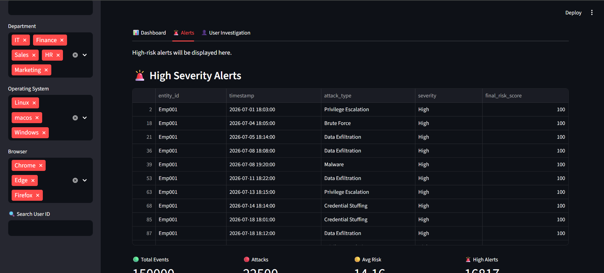
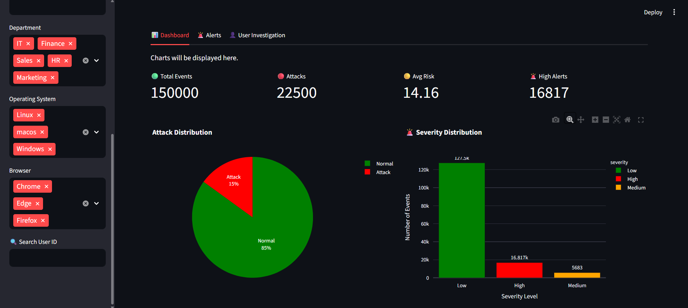

# 🛡️ AI-Powered User Behavior Analytics & Anomaly Detection

An end-to-end cybersecurity project that simulates user activity, generates synthetic attack scenarios, detects anomalous behavior using Machine Learning (Isolation Forest), and visualizes security events through an interactive Streamlit dashboard.

---

## 📖 Project Overview

Organizations generate thousands of user login events every day. Identifying suspicious behavior manually is difficult and time-consuming.

This project simulates a real-world Security Operations Center (SOC) by:

- Generating synthetic employee and login data
- Simulating multiple cyber attack scenarios
- Detecting anomalous behavior using Isolation Forest
- Assigning dynamic risk scores
- Displaying security insights in an interactive dashboard

---

## 🚀 Features

### 👤 Synthetic User Generation
- Generate realistic employee profiles
- Departments, cities, browsers, operating systems
- Authentication methods
- Assigned resources

### 📄 Login Log Generation
- Normal user login sessions
- Resource access simulation
- Session duration
- Login timestamps

### 🚨 Cyber Attack Simulation
The project simulates multiple attack scenarios including:

- Brute Force Attack
- Credential Stuffing
- Impossible Travel
- VPN Login
- Malware Activity
- Privilege Escalation
- Data Exfiltration

Each attack is assigned different:
- Risk Score
- Failed Login Attempts
- Severity Level

---

## 🤖 Machine Learning

Algorithm Used:

- Isolation Forest

Feature Engineering includes:

- Login Hour
- Failed Attempts
- Risk Score
- Login Status Encoding
- Timestamp Processing

Model Performance:

- Accuracy: **96.64%**
- Precision: **88.80%**
- Recall: **88.80%**
- F1 Score: **88.80%**

---

## 📊 Dashboard Features

The Streamlit dashboard includes:

- 📈 Security KPIs
- 🎯 Attack Distribution
- 📊 Severity Analysis
- 🖥️ Operating System Analysis
- 🌐 Browser Distribution
- 👥 Department-wise Analysis
- 🔎 User Search
- 🚨 High Risk Alert Table
- 📥 CSV Export for High Risk Alerts

---

## 🛠️ Technologies Used

- Python
- Pandas
- NumPy
- Faker
- Scikit-learn
- Plotly
- Streamlit

---

## 📂 Project Structure

```text
AI-Powered-Anomaly-Detection/
│
├── dashboard/
│   └── app.py
│
├── generator/
│   ├── user_generator.py
│   ├── normal_logs.py
│   ├── attack_generator.py
│   ├── feature_engineering.py
│   ├── model_trainig.py
│   ├── evaluation.py
│   └── risk_scoring.py
│
├── data/
│   ├── users.csv
|   ├── normal_logs.csv
│   ├── attack_logs.csv
│   ├── predictions.csv
│   └── final_results.csv
│
├── screenshots/
│
├── requirements.txt
├── README.md
└── .gitignore
```

---

## ⚙️ Installation

Clone the repository

```bash
git clone https://github.com/Muskaan2023/AI-Powered-Anomaly-Detection.git
```

Move into the project directory

```bash
cd AI-Powered-Anomaly-Detection
```

Install dependencies

```bash
pip install -r requirements.txt
```

Run the Streamlit dashboard

```bash
streamlit run dashboard/app.py
```

---

## 📸 Dashboard Preview

### Main Dashboard


### High Risk Alerts



### Analytics Dashboard



---

## 🎯 Future Enhancements

- Real-time log streaming
- Explainable AI recommendations
- Email alert notifications
- Geo-location attack visualization
- User authentication
- Cloud deployment
- Threat Intelligence Integration

---

## 👩‍💻 Author

**Muskaan Khatoon**

Cybersecurity | Machine Learning | Python | Streamlit

---

## ⭐ Support

If you found this project useful, consider giving it a ⭐ on GitHub.